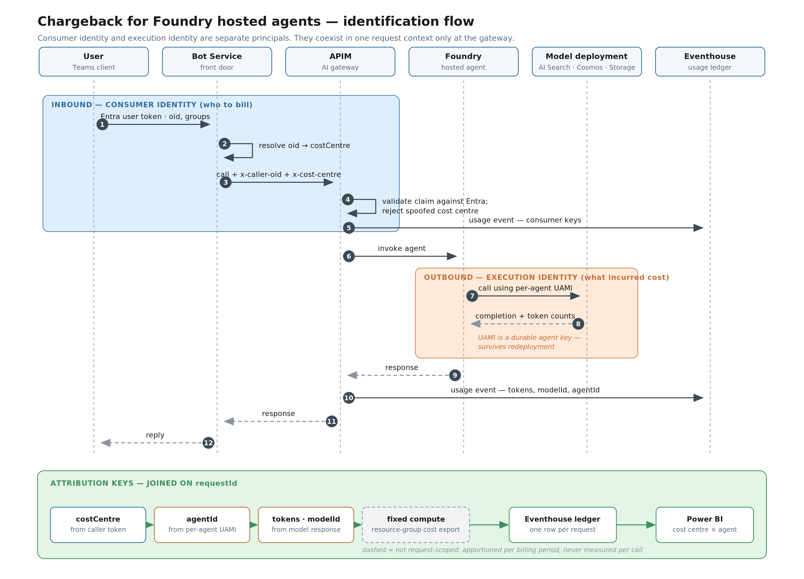
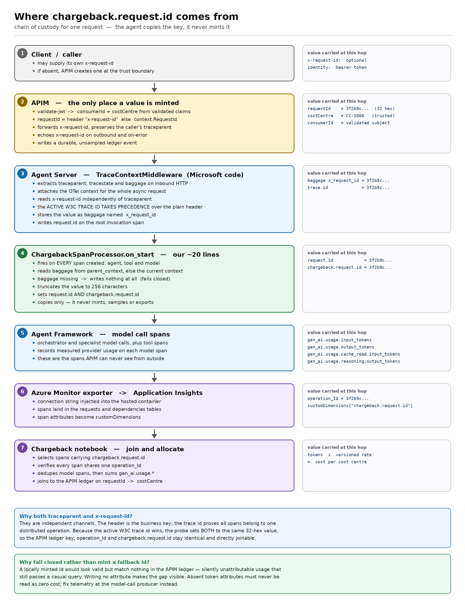

# foundry-chargeback-kit

Correlates an authenticated consumer request at Azure API Management (APIM) with
every model and tool span a Microsoft Foundry hosted agent produces, so token
usage can be attributed to a consumer or cost centre.

It produces **audit-grade showback**. It does not turn each request into an Azure
invoice line — Azure Cost Management remains the financial source of truth.

## The problem

APIM sees one call to the hosted-agent endpoint. The orchestrator and its
specialist model calls happen *inside* the hosted container, so their usage never
traverses the gateway. APIM token-limit policies cannot see them, and the outer
Responses API reply does not expose them either.

Usage must therefore be read from agent telemetry and joined back to the gateway
request.

## Correlation model

```text
authenticated consumer -> requestId -> traceId -> model spans -> token usage
```



Consumer identity (*who to bill*) and execution identity (*what incurred the
cost*) are separate principals that coexist in one request context only at the
gateway. `requestId` is what joins them afterwards. Fixed compute is shown
dashed because it is apportioned per billing period, never measured per call.

| Value | Owner | Purpose |
|---|---|---|
| `consumerId` / `costCentre` | APIM | Trusted chargeback dimension derived from authenticated identity |
| `x-request-id` | APIM | Stable 32-hex business request identifier, echoed to the caller |
| `traceparent` | OpenTelemetry | Carries that identifier as its W3C trace ID plus the parent-span relationship |
| `operation_Id` | Application Insights | Joins the root invocation to model and tool spans |
| `gen_ai.response.id` | Foundry | Operational audit key for a hosted-agent response |
| `gen_ai.usage.*` | Agent Framework | Measured usage on each model-call span |

Never use a caller-supplied cost-centre header as authoritative identity.

## How it works

1. APIM authenticates the caller and derives the consumer and cost centre from
   validated claims or a server-side mapping.
2. APIM forwards `x-request-id` and preserves the W3C `traceparent`.
3. Foundry Agent Server extracts the trace context and stores `x-request-id` as
   OpenTelemetry baggage named `x_request_id`.
4. [agent/telemetry.py](agent/telemetry.py) registers `ChargebackSpanProcessor`,
   which copies that value to `request.id` and `chargeback.request.id` on every
   agent, tool and model span.
5. Agent Framework records measured usage in `gen_ai.usage.*` attributes.
6. Application Insights stores the shared W3C trace ID as `operation_Id`.
7. The kit queries those spans, verifies lineage, deduplicates model spans and
   applies versioned rates.



APIM is the only place a value is minted. Every later hop copies it, and
`ChargebackSpanProcessor` fails closed — if the baggage is missing it writes no
attribute at all, so an unattributable request stays visible instead of being
silently priced at zero.

Agent Server gives the active W3C trace ID precedence over the plain
`x-request-id` header, so the kit uses **one** lowercase 32-hex value for both.

## Why the request ID is also the trace ID

`traceparent` is the W3C Trace Context header — the standard way to carry
distributed-trace identity across process boundaries:

```text
00-c4f94d0383e94314b1151202a6845ca9-b8e36b3677ff4e61-01
│  │                                │                │
│  │                                │                └─ trace-flags: 01 = sampled
│  │                                └─ parent-id (span-id): the caller's span
│  └─ trace-id: constant for the whole distributed operation
└─ version
```

The **trace-id** identifies the operation; every span in every service inherits
it, and Application Insights stores it as `operation_Id`. The **parent-id**
identifies the specific calling span, which is what lets the receiver attach its
spans as children. The sampled flag matters too: with `00`, downstream SDKs may
drop the spans and there is no usage left to price.

The kit sets the trace ID to the same value as `x-request-id` for three reasons.

1. **Agent Server prefers the trace ID.** When it decides what to stamp as
   `request.id`, the active W3C trace ID takes precedence over the plain header.
   If the two differ, spans get labelled with the trace ID while the gateway
   ledger holds the header value, and the join silently returns nothing.
2. **One key instead of two.** The ledger key, `operation_Id` and
   `chargeback.request.id` become the same string, so a gateway row leads
   straight to the model spans. Otherwise every query needs the two-step lookup
   in [SETUP.md](SETUP.md) step 7: find the root span by `request.id`, read its
   `operation_Id`, then aggregate spans carrying that `operation_Id`.
3. **Corroboration.** The same value arriving through two independent mechanisms
   — an application-written attribute and OpenTelemetry context propagation — is
   stronger evidence than either alone.

This is why [correlation.py](src/foundry_chargeback_kit/correlation.py) rejects
anything that is not lowercase 32-hex and nonzero. A value such as
`req-probe-0001` is not a valid trace ID and would be silently replaced.

### When to stop doing this

Collapsing the two identifiers is a **test-harness simplification**.

- It conflates two concepts. A trace ID is an operational correlation
  identifier; a request ID is a business key on a financial record. Retries get
  a fresh trace ID, which forces a decision about whether they are the same
  billable request.
- Caller-controlled trace IDs are a security concern. In this prototype the
  client mints the value and APIM forwards it, so a caller could reuse another
  tenant's trace ID and inject spans into their operation, or collide IDs to
  corrupt aggregation.
- It fights APIM's own instrumentation. With Application Insights diagnostics
  enabled, APIM establishes the trace itself; forcing a caller-supplied trace ID
  either overrides that or creates a second, disconnected trace.

In production, let APIM or the caller's genuine upstream context own
`traceparent`, mint `x-request-id` server-side at the trust boundary with
validated length and character set, and accept the two-step join.

## Layout

| Path | Purpose |
|---|---|
| [agent/](agent) | The instrumented hosted agent — an in-process multi-agent orchestrator that delegates to research, analysis and review specialists |
| [agent/telemetry.py](agent/telemetry.py) | `ChargebackSpanProcessor`, the span enrichment that makes attribution possible |
| [apim/policy-chargeback.xml](apim/policy-chargeback.xml) | Gateway correlation policy fragment |
| [apim/apply_policy.py](apim/apply_policy.py) | Merges the fragment into an exported policy without losing existing rules |
| [src/foundry_chargeback_kit/](src/foundry_chargeback_kit) | Client library: correlation, gateway calls, Application Insights queries, showback |
| [notebooks/chargeback-acceptance.ipynb](notebooks/chargeback-acceptance.ipynb) | The proof — one request, staged assertions, priced result |

## Quick start

```bash
uv venv --python 3.13
source .venv/bin/activate
uv pip install -e .
cp .env.example .env   # then fill it in
az login
```

Verify the gateway forwards and echoes the correlation key:

```bash
python -m foundry_chargeback_kit.cli probe
```

Run the full acceptance test — one call, then poll telemetry until usage arrives:

```bash
python -m foundry_chargeback_kit.cli e2e --json
```

Or work through it stage by stage, with the span tree and priced result shown
at each step:

```bash
uv pip install -e '.[notebook]'
python -m ipykernel install --user --name foundry-chargeback-kit \
  --display-name 'Foundry chargeback kit'
jupyter notebook notebooks/chargeback-acceptance.ipynb
```

Select the **Foundry chargeback kit** kernel before running the notebook.

On WSL with the repository on a Windows drive (`/mnt/c/...`), export
`UV_LINK_MODE=copy` first. Hardlinking fails on DrvFs and produces
invalid-wheel errors.

A valid result requires all of the following:

- APIM echoes the exact request ID.
- Application Insights returns spans carrying that value as `chargeback.request.id`.
- Every selected span shares one `operation_Id`.
- At least one deduplicated `chat` span reports measured token usage.

Missing usage attributes are **missing data**, not zero-cost usage. The kit fails
rather than pricing an unmeasured request.

Full deployment sequence: [SETUP.md](SETUP.md).

## Cost calculation

```text
estimated variable cost =
    (input tokens - cached tokens) * input rate
  + cached tokens                  * cached-input rate
  + output tokens                  * output rate
  + separately metered tool/service usage
```

Fixed costs — always-on hosted compute, APIM capacity, telemetry ingestion — are
apportioned by an explicit rule and must be labelled as allocation, not measured
usage. Rates in [showback.py](src/foundry_chargeback_kit/showback.py) are
indicative placeholders; replace them with your contracted price list.

## Known limits

- The outer hosted-agent response does not expose internal model usage.
- APIM token policies only measure calls that physically traverse APIM.
- Application Insights ingestion is asynchronous and may be sampled. Financial
  ledger events need a separate durable, unsampled sink such as Event Hubs.
- A trace proves execution lineage, not the invoiced amount.
- Shared and fixed costs need allocation rules, not tracing.
- When the authenticated caller is a shared service principal, application or
  cost-centre scope is the honest attribution ceiling.

## Security

- Derive chargeback dimensions from validated claims, never from caller headers.
- Do not store subscription keys, bearer tokens, prompts or completions in the
  ledger. `OTEL_INSTRUMENTATION_GENAI_CAPTURE_MESSAGE_CONTENT=false` keeps
  message content out of telemetry.
- Do not commit `.env` or exported APIM policies containing secrets.

## Licence

MIT. See [LICENSE](LICENSE).
